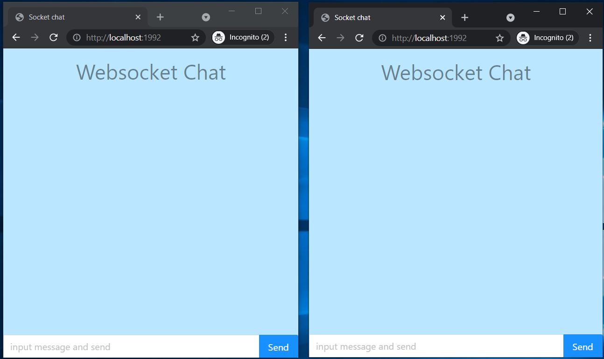

# Sample Web Client application based on WebSocket and React

Tutorial based on: https://www.youtube.com/watch?v=LenNpb5zqGE

Learn WebSocket: https://blog.logrocket.com/websockets-tutorial-how-to-go-real-time-with-node-and-react-8e4693fbf843/

To run client:
- open terminal and execute: `cd webSocketClient && npm start`
- navigate to http://localhost:1992/
- make sure to open multiple tab to test multiuser behaviour

To run server:
- open another terminal and execute: `cd webSocketServer && npm start`

### Screenshots

